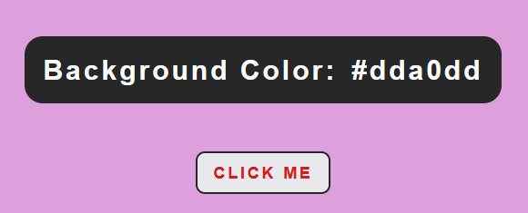

<h1 align="center">Color Flipper</h1>
<h2 align="center">

</h2>

<h3 align="center">
    <a href="https://color-flipperrr.netlify.app/" target="_blank">Life Demo</a>
</h3>

### Description
___
The essence of the game is to switch the background color using a button. There are also buttons in the navbar that switch the color format: **rgb** or **hex**

I took the idea and design from the video from *freeСodeСamp*, but the logic of the project is completely mine. If anyone is interested, here is a link to the <a href="https://youtu.be/3PHXvlpOkf4">video</a> (there are a lot of cool projects :fire:)

The game is created with native JS and CSS, without any frameworks and libraries. 

### How it works
___

Using js, I generate all possible color options. For example, a function to create a hex color:

### Additionally
___

I've learned myself web development without any courses or training, so if you have any comments, I will be happy to chat with you on social networks (see  my <a href="https://github.com/liyakot">profile</a> :fire:)